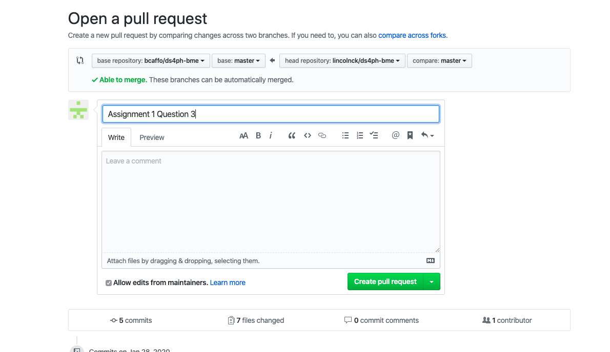
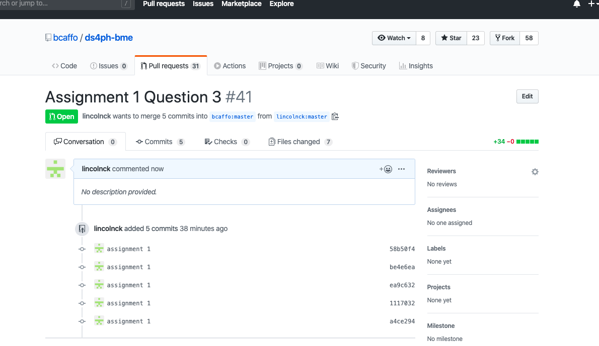
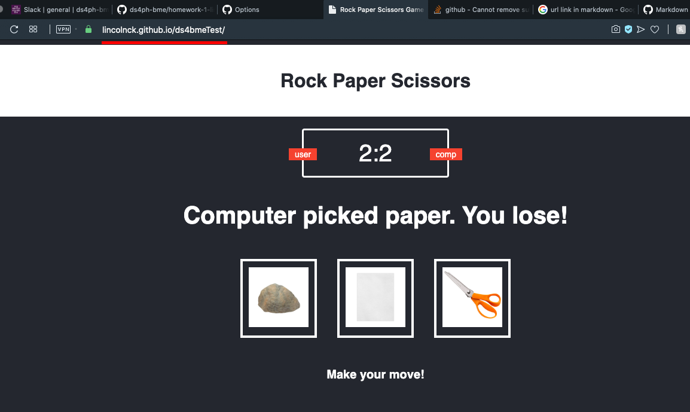

# Assignment 1

1. This is the markdown file I created for assignment one.

2. I forked the course repository, essentially copying it to my own github account. 

`2a.png`

I then cloned it to my local machine in order to create the new `Test` directory and `readme.md` file all in the terminal. 

`2b.png`

After making some changes in this markdown file, I added, committed and pushed the changes to github.

`2c.png`

3. 

`3a.png`

`3b.png`

4. 

`4a.png`

`4b.png`

5.

Website link for a simple rock/paper/scissors game hosted on github pages:
[Rock/Paper/Scissors](https://lincolnck.github.io/ds4bmeTest/)

`5.png`

6. The bash script is found in this repository as `lsfile`. It takes in two parameters - a directory to `ls` the contents of, and a `file` you want to save the output of that `ls` command to. This can be run by executing the following from whatever directory `lsfile` is in:

`./lsfile directory outputfile`

7. The bash script is found in this repository as `dcmrecurse`. It takes in one parameter - the name of a `outputfile` that you want to save the ouput of the script to. `dcmrecurse` begins at `~` and recursively searches through all directories to find any files that end in `.dcm`. It can be run by executing the following from whatever directory `dcmrecurse` is in:

`./dcmrecurse outputfile`

